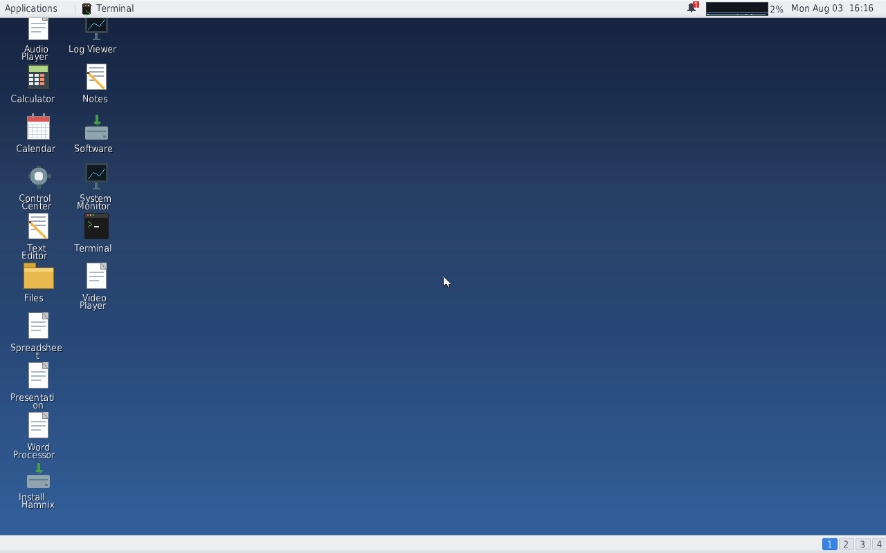
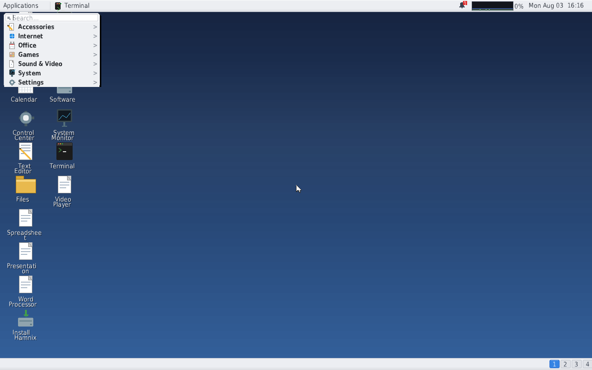

# Hamnix screenshots — 2026-08-03

Every image on this page is a **real framebuffer scanout** taken from a booted
Hamnix system, captured with the QEMU monitor's `screendump` while the guest
was running. None of them is a host-side render, a mock-up, or a composite.

The honest inventory that goes with these images is
[`docs/what_works.md`](../what_works.md). **Read that before quoting any of
these pictures** — several of them show apps that render beautifully and then
do nothing when you type at them.

---

## Provenance

| | |
|---|---|
| Image | `build/hamnix-installer.img`, 102,760,448 bytes, built 2026-08-03 08:53 |
| SHA-256 | `77c6a4f42c3c5a1521d044e9b658d61c879b8668b07dfbc6cde9e3e2431fbc75` |
| Built from | `main` @ `238ba35f`. Later commits on the capture branch touch only `scripts/`, so no image input changed; the recorded `git_head` in `provenance.txt` is the HEAD at capture time, not at build time. |
| Kernel backend | `HAMNIX_KERNEL_BACKEND=llvm` (the shipped default) |
| Machine | `qemu-system-x86_64 -enable-kvm -cpu host -bios OVMF -m 1G -vga std` |
| Network | **none** — no `-netdev`, no NIC |
| Screen | 1280×800 |
| Captured | 2026-08-03, five boots (`build/release_shots/batched/b1`..`b5`) |
| Kernel faults during capture | 0 |

The exact byte counts, SHA-256 and build stamp are in
[`provenance.txt`](provenance.txt); the raw per-app measurements are in
[`verdicts.tsv`](verdicts.tsv).

## How these were made, and what the crops mean

`scripts/capture_release_screenshots.sh` boots the shipped image into the
scene DE, waits for the serial handoff, then for each launcher in
`etc/hamde/apps/` writes `echo /bin/<app> > /dev/wsys/run/launch` — the real
DE launch queue the panel uses — and screendumps the framebuffer four times:
before the launch, after the window settles, after a burst of real PS/2
keystrokes, and after trying to kill it.

**The desktop-only frames (`00-desktop`, `01-appmenu*`) are whole, untouched
1280×800 frames.** The per-app images are **cropped** to the window that
appeared. The crop is not cosmetic: a launched app's window cannot be
dismissed from the driver at all (`kill` does not unmap it, and the `free
<wid>` ctl verb is hostowner-gated), so windows accumulate. Capturing in five
batches of ~6 apps keeps the desktop legible, and cropping to the
changed-pixel region isolates the app. Everything inside the crop is
unmodified scanout. One image — Tetris — uses an explicit crop rectangle,
because its window chrome is pixel-identical to the Snake window it covers
and no threshold can find its frame; the whole-frame version is in
`build/release_shots/batched/b4/18-hamtetris-b-running.png`.

---

## The desktop

Wallpaper, a top panel with the Applications menu, a clock and CPU applet, 16
desktop icons in two columns, a bottom taskbar and a four-workspace switcher.
Note the icon labels breaking mid-word ("Spreadshee/t", "Presentati/on").

## The Applications menu

The menu opens with a search box and seven categories. All seven are
**collapsed**, and there is no keyboard way to expand them — Down and Right do
nothing. The panel reports it absorbed all 26 native launchers plus one Linux
entry: `[panel] appmenu entries: 27 (linux section: 1)`.

Typing in the search box filters the catalogue live and groups hits by
category. The popup is a fixed size and **truncates** rather than growing or
scrolling — the "Games" section here is cut off mid-list. Backspace is
ignored, so a mistyped filter can only be cleared by reopening the menu.

---

## The 26 shipped applications

Verdict key — measured, not asserted:

* **launched** — the kernel logged `[devwsys] window <wid> mapped pid=<n>`.
* **rendered** — changed pixels between the pre-launch and settled frames.
  A blank window frame is a few hundred; every app here is in the tens of
  thousands.
* **typed** — changed pixels after a burst of real PS/2 keystrokes. `0` means
  the app did not visibly react to *the keys we sent*; for a mouse-driven app
  that is expected, for a game with documented keyboard controls it is not.
* **closed** — could the app be shut down? `no` everywhere but one, and that
  one closed *itself* on a keypress rather than being closed by us.

| # | App | Binary | launched | rendered px | typed px | closed |
|---|---|---|---|---|---|---|
| 02 | [Audio Player](02-audioplayer.png) | `hamaudioscene` | yes | 134,870 | 0 | no |
| 03 | [Web Browser](03-browser.png) | `hambrowse` | yes | 394,654 | 21,832 | no |
| 04 | [Calculator](04-calculator.png) | `hamcalcscene` | yes | 60,256 | 112 | no |
| 05 | [Calendar](05-calendar.png) | `hamcalscene` | yes | 29,622 | 903 | no |
| 06 | [Coin Dash](06-coindash.png) | `hamgamedemo` | yes | 65,989 | 429 | no |
| 07 | [Control Center](07-control-center.png) | `hamctl` | yes | 202,134 | 0 | no |
| 08 | [Editor](08-editor.png) | `hameditscene` | yes | 47,801 | 1,064 | no |
| 09 | [Files](09-files.png) | `hamfmscene` | yes | 87,168 | 0 | no |
| 10 | [2048](10-ham2048.png) | `ham2048scene` | yes | 153,485 | 20,161 | no |
| 11 | [Chess](11-hamchess.png) | `hamchessscene` | yes | 175,307 | 0 | no |
| 12 | [Snake (hamGame)](12-hamgamesnake.png) | `hamgamesnake` | yes | 57,418 | 0 | no |
| 13 | [Input Inspector](13-haminput.png) | `haminput` | yes | 207,664 | 0 | no |
| 14 | [Minesweeper](14-hammine.png) | `hamminescene` | yes | 97,620 | 1,264 | no |
| 15 | [Spreadsheet](15-hamsheet.png) | `hamsheet` | yes | 183,437 | 402 | no |
| 16 | [Presentation](16-hamslides.png) | `hamslides` | yes | 231,956 | 2,567 | no |
| 17 | [Snake](17-hamsnake.png) | `hamsnakescene` | yes | 174,916 | 0 | no |
| 18 | [Tetris](18-hamtetris.png) | `hamtetrisscene` | yes | 38,501 | 3,072 | no |
| 19 | [Word Processor](19-hamwrite.png) | `hamwrite` | yes | 286,872 | 636 | no |
| 20 | [Install Hamnix](20-installer.png) | `haminstallui` | yes | 24,727 | 0 | no |
| 21 | [Log Viewer](21-logviewer.png) | `hamlogscene` | yes | 161,181 | 0 | no |
| 22 | [Notes](22-notes.png) | `hamnotesscene` | yes | 159,305 | 536 | no |
| 23 | [Software](23-packagemanager.png) | `hamsoftware` | yes | 156,032 | 0 | no |
| 24 | [Screenshot](24-screenshot.png) | `hamshotui` | yes | 64,375 | 64,375 | **self** |
| 25 | [System Monitor](25-sysmon.png) | `hammonscene` | yes | 178,011 | 5,535 | no |
| 26 | [Terminal](26-terminal.png) | `hamtermscene` | yes | 101,074 | 4,344 | no |
| 27 | [Video Player](27-videoplayer.png) | `hamvideoscene` | yes | 84,770 | 2,655 | no |

**26 / 26 launched. 26 / 26 rendered a real UI. 16 / 26 reacted to the
keyboard. 0 / 26 could be closed by us.**

Two independent full runs (`build/release_shots/run1` and the five batches)
produced the same verdicts for every app.

### The ones to look at twice

* **Snake** (17) and **Snake (hamGame)** (12) are already showing **GAME
  OVER** in their launch screenshots. Both start the snake moving the instant
  the window maps, so it hits a wall before a human could react. These are the
  screenshots a first-time user gets.
* **Input Inspector** (13) is a black debug console reading *"ready — click
  the window, then press keys / click mouse buttons"*. It is a developer
  diagnostic shipping as an application.
* **Software** (23) is rendering `hpm`'s stdout as package rows: the first two
  entries are `[runtime:hpm]` (a loader log line) and `hpm: cached index; run
  \`hpm refresh\` first` (a diagnostic), both with green "installed" badges.
  On the same boot, `hpm list` on the console says *"no packages installed"*
  while this window says *"28 packages in the index / 28 installed"*.
* **Web Browser** (03) renders its demo page well, but the tab title reads
  `ignored` instead of the page's title.
